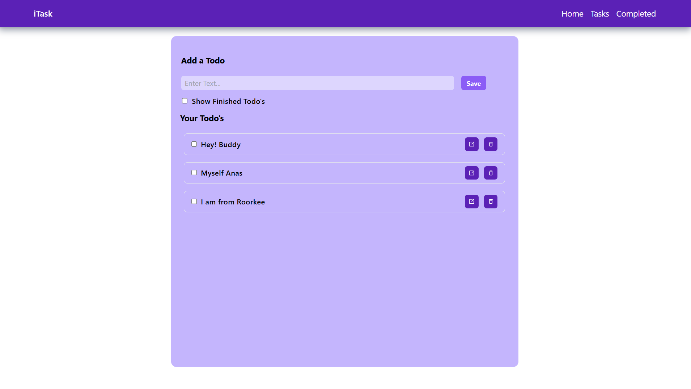
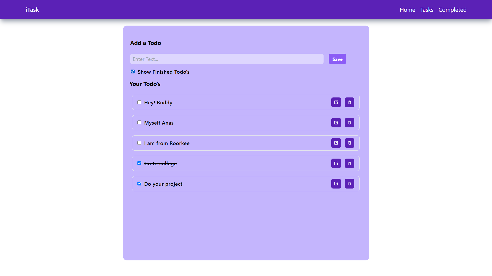

iTask - Your Task Planner

A simple yet powerful task management application built with React and Tailwind CSS. iTask helps you organize your tasks efficiently with features like adding, editing, deleting, and marking tasks as completed.

🚀 Features

Add new tasks with ease

Edit existing tasks

Delete tasks when no longer needed

Mark tasks as completed/incomplete

Persistent storage using LocalStorage

Responsive and modern UI with Tailwind CSS

🖥️ Technologies Used

React.js

Tailwind CSS

React Icons

UUID (for unique task IDs)

## 📸 Screenshots

🔧 Installation & Setup

Clone the repository

git clone https://github.com/Anasmalik57/TodoList_App.git
cd TodoList_App

Install dependencies

npm install

Run the development server

npm run dev

Open http://localhost:5173 (or the specified port) in your browser.

📜 Usage

Add a task: Type in the input field and click the Save button.

Mark task as completed: Check the box next to a task.

Edit a task: Click the edit icon (✏️) to modify the task.

Delete a task: Click the trash icon (🗑️) to remove a task.

Show/hide completed tasks: Use the checkbox toggle.

🛠️ Project Structure

TodoList_App/
│-- src/
│   ├── components/
│   │   ├── Navbar.js
│   ├── App.js
│   ├── main.jsx
│   ├── index.css
│-- public/
│-- package.json
│-- README.md

📌 Contributing

Feel free to contribute to this project! You can:

Report bugs

Suggest new features

Submit pull requests

📄 License

This project is open-source and available under the MIT License.

📎 Repository Link

🔗 GitHub Repo